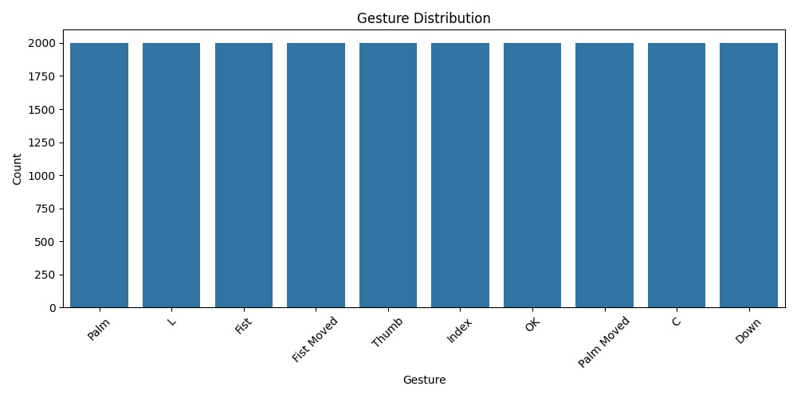
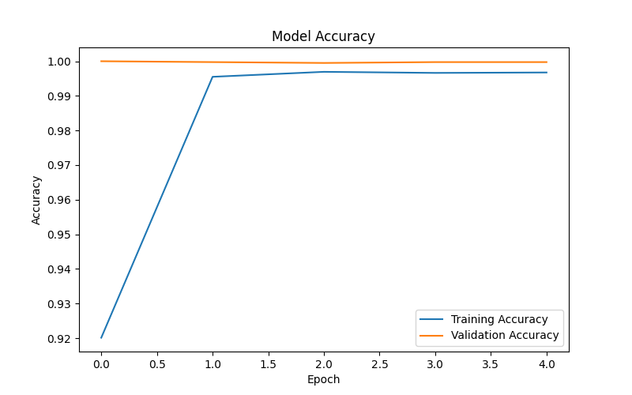
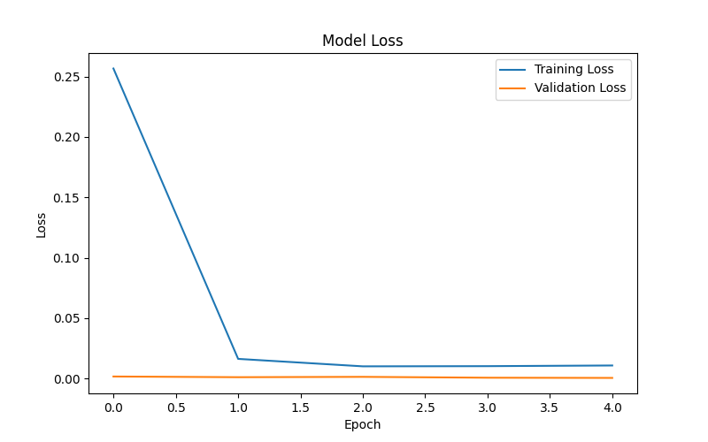
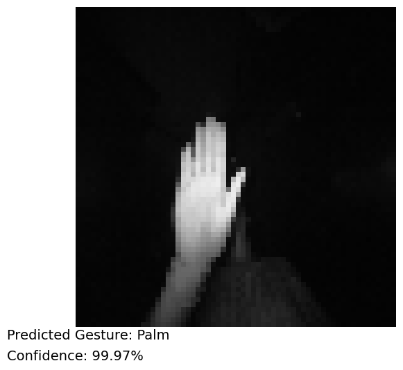

# SCT_ML_4 - Hand Gesture Recognition using CNN

# Project Overview

This project implements a Hand Gesture Recognition System using a Convolutional Neural Network (CNN). The model is trained on the LeapGestRecog Dataset and can classify different hand gestures from image data. The goal of this project is to enable gesture-based human-computer interaction.

# Features

- Hand Gesture Classification using CNN
- Image Preprocessing with OpenCV
- Gesture Distribution Visualization
- Model Accuracy Visualization
- Model Loss Visualization
- Gesture Prediction with Confidence Score
- Trained Model Generation

# Dataset

Dataset: LeapGestRecog Dataset

The dataset contains the following hand gestures:

- Palm
- L
- Fist
- Fist Moved
- Thumb
- Index
- OK
- Palm Moved
- C
- Down

# Technologies Used

- Python
- TensorFlow
- Keras
- OpenCV
- NumPy
- Matplotlib
- Seaborn
- Scikit-learn

# Project Structure

```text
SCT_ML_4/
│
├── hand_gesture_recognition.py
├── requirements.txt
├── README.md
├── gesture_distribution.png
├── accuracy_graph.png
├── loss_graph.png
├── gesture_prediction.png
└── hand_gesture_model.h5
```

# Installation

Install the required libraries:

```bash
pip install -r requirements.txt
```

# Run the Project

```bash
python hand_gesture_recognition.py
```

# Output

The project generates:

- Gesture Distribution Graph
- Accuracy Graph
- Loss Graph
- Gesture Prediction Result
- Trained CNN Model

# Results

# Gesture Distribution



# Model Accuracy



# Model Loss



# Gesture Prediction



# Learning Outcomes

Through this project, I gained practical experience in:

- Deep Learning
- Convolutional Neural Networks (CNN)
- Computer Vision
- Image Classification
- Data Preprocessing
- Model Evaluation

# Acknowledgement

This project was completed as part of the Machine Learning Internship Program at SkillCraft Technology. It provided valuable hands-on experience in deep learning and computer vision applications.